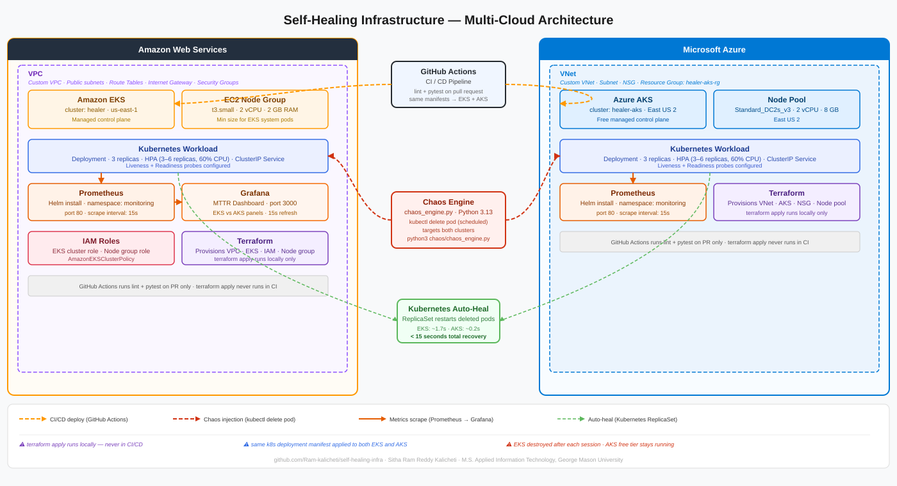
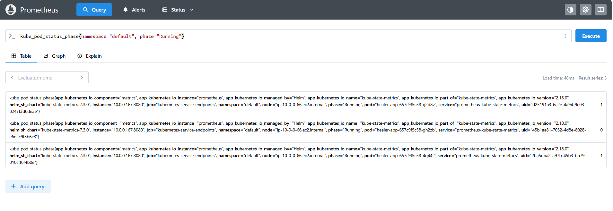
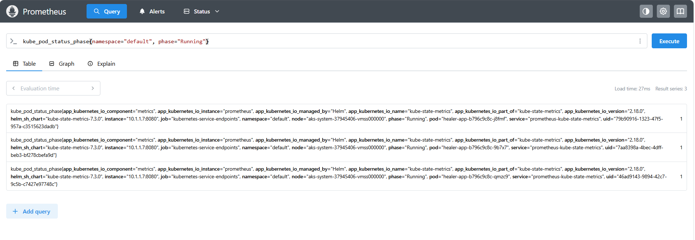
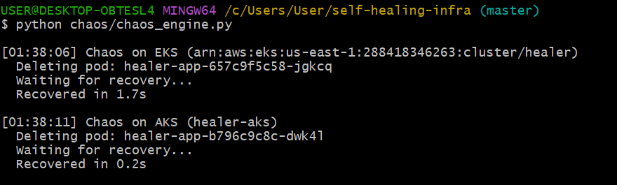
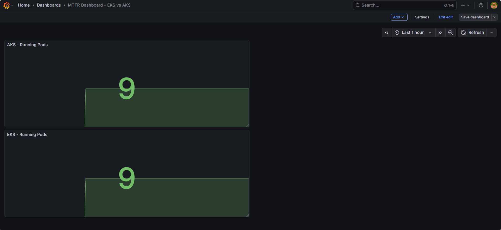

# Self-Healing Infrastructure

A multi-cloud Kubernetes platform that automatically detects and recovers from failures across AWS EKS and Azure AKS. Infrastructure is fully provisioned via Terraform with custom VPC/VNet networking. A Python chaos engine deletes pods on a schedule, Kubernetes ReplicaSets auto-heal in under 15 seconds, and Prometheus + Grafana surface real-time MTTR metrics across both clusters.



---

## Architecture

```
Terraform AWS  → Custom VPC (10.0.0.0/16) + subnets + IGW + SGs → Amazon EKS · t3.small · us-east-1
Terraform Azure → VNet (10.1.0.0/16) + subnet + NSG             → Azure AKS · Standard_DC2s_v3 · East US 2
                                  ↓
        k8s: Deployment (3 replicas) + ClusterIP Service + HPA (3–6 replicas, 60% CPU)
                                  ↓
        Python chaos engine → kubectl delete pod → ReplicaSet auto-heals < 15s
                                  ↓
        Prometheus scrapes kube-state-metrics from both clusters every 15s
        Grafana → side-by-side MTTR dashboard (EKS vs AKS)
                                  ↓
        GitHub Actions: lint + pytest on PR only
        terraform apply runs locally — not in CI
```

---

## Cluster Configuration

| | AWS EKS | Azure AKS |
|---|---|---|
| Cluster name | `healer` | `healer-aks` |
| Region | us-east-1 | East US 2 |
| Node size | t3.small (2 vCPU, 2 GB) | Standard_DC2s_v3 (2 vCPU, 8 GB) |
| Network | VPC 10.0.0.0/16 | VNet 10.1.0.0/16 |
| Control plane cost | $0.10/hr | Free |
| kubectl context | `arn:aws:eks:us-east-1:288418346263:cluster/healer` | `healer-aks` |

> **Why t3.small on EKS:** t2.micro cannot run EKS — system pods alone consume ~700 MB of the 1 GB available, leaving app pods in Pending indefinitely.

---

## Repository Structure

```
self-healing-infra/
├── terraform/
│   ├── aws/                    # VPC, subnets, IGW, SGs, IAM, EKS cluster + node group
│   └── azure/                  # VNet, subnet, NSG, resource group, AKS cluster
├── k8s/
│   └── deployment.yaml         # 3-replica Deployment + ClusterIP Service + HPA
├── chaos/
│   └── chaos_engine.py         # Deletes pods on schedule, logs recovery time per cluster
├── monitoring/
│   └── README.md               # Prometheus Helm flags and PromQL reference
├── screenshots/
│   ├── prometheus-eks.png
│   ├── prometheus-aks.png
│   ├── chaos-engine-recovery.png
│   └── grafana-dashboard.png
└── .github/
    └── workflows/              # lint + pytest on PR only
```

---

## Prerequisites

- AWS CLI configured with IAM permissions for EKS, VPC, EC2
- Azure CLI authenticated (`az login`) with an active subscription
- Terraform >= 1.0
- kubectl
- Helm 3
- Python 3.13

---

## Deployment

### 1. Provision EKS

```bash
cd terraform/aws
terraform init
terraform apply -auto-approve
aws eks update-kubeconfig --region us-east-1 --name healer
```

### 2. Provision AKS

```bash
cd terraform/azure
terraform init
terraform apply -auto-approve
az aks get-credentials --resource-group healer-aks-rg --name healer-aks
```

### 3. Verify both contexts

```bash
kubectl config get-contexts
kubectl get nodes --context=arn:aws:eks:us-east-1:288418346263:cluster/healer
kubectl get nodes --context=healer-aks
```

### 4. Deploy Application

```bash
kubectl apply -f k8s/deployment.yaml
```

### 5. Install Prometheus

```bash
helm repo add prometheus-community https://prometheus-community.github.io/helm-charts
helm repo update

# EKS
helm install prometheus prometheus-community/prometheus \
  --namespace monitoring --create-namespace \
  --kube-context=arn:aws:eks:us-east-1:288418346263:cluster/healer \
  --set alertmanager.enabled=false \
  --set pushgateway.enabled=false \
  --set server.persistentVolume.enabled=false

# AKS
helm install prometheus prometheus-community/prometheus \
  --namespace monitoring --create-namespace \
  --kube-context=healer-aks \
  --set alertmanager.enabled=false \
  --set pushgateway.enabled=false \
  --set server.persistentVolume.enabled=false
```

### 6. Install Grafana

```bash
helm repo add grafana https://grafana.github.io/helm-charts

helm install grafana grafana/grafana \
  --namespace monitoring \
  --kube-context=arn:aws:eks:us-east-1:288418346263:cluster/healer \
  --set persistence.enabled=false

# Retrieve admin password
kubectl get secret --namespace monitoring grafana \
  -o jsonpath="{.data.admin-password}" \
  --context=arn:aws:eks:us-east-1:288418346263:cluster/healer | base64 --decode
```

Add Prometheus as a Grafana data source:
```
http://prometheus-server.monitoring.svc.cluster.local:80
```

### 7. Run Chaos Engine

```bash
python3 chaos/chaos_engine.py
```

The engine deletes pods across both clusters on a configurable interval. Verified recovery times: **EKS ~1.7s, AKS ~0.2s**.

---

## Observability

**PromQL queries used in the MTTR dashboard:**

```promql
# Total running pods
sum(kube_pod_status_phase{phase="Running"})

# Running pods by namespace
sum by (namespace) (kube_pod_status_phase{phase="Running"})

# Cumulative restarts — tracks chaos recovery events
sum(kube_pod_container_status_restarts_total)
```

Grafana dashboard: `MTTR Dashboard - EKS vs AKS` — Stat panels, 15s refresh.

---

## Teardown

```bash
cd terraform/aws && terraform destroy -auto-approve
cd terraform/azure && terraform destroy -auto-approve
```

---

## Screenshots

| | |
|---|---|
| Prometheus — EKS |  |
| Prometheus — AKS |  |
| Chaos engine recovery log |  |
| Grafana MTTR dashboard |  |

---

## Author

**Sitha Ram Reddy Kalicheti**  
M.S. Computer Science — George Mason University  
[github.com/Ram-kalicheti](https://github.com/Ram-kalicheti)
